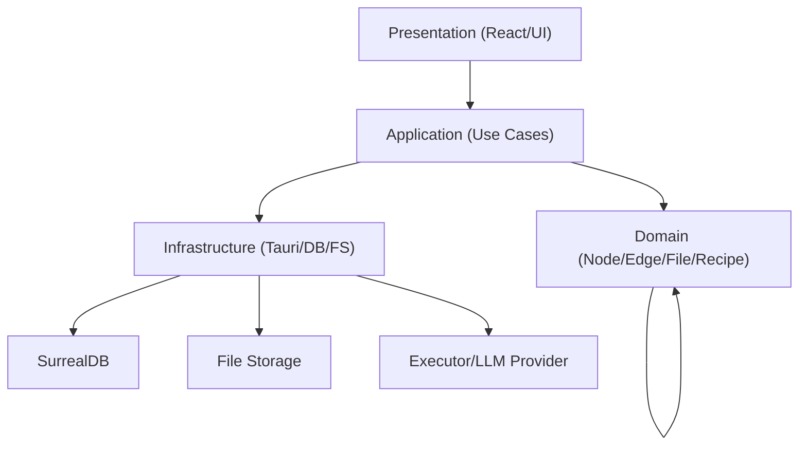

# DDD V1.6 边界上下文与现有代码映射

## 边界上下文（Bounded Context）

### 1) Canvas Context
- 核心概念：Node / Edge / Presentation / Mapping
- 职责：画布交互、节点状态管理、连线与映射规则
- 领域服务：ValueMappingService / NodePresentationService

### 2) Execution Context
- 核心概念：Recipe / ExecutionRun
- 职责：配方执行、运行状态、日志记录
- 领域服务：RecipeExecutionService

### 3) File Context
- 核心概念：File / Ingestion / Variants
- 职责：文件导入、预处理、元信息
- 领域服务：FileIngestionService

### 4) Project Context
- 核心概念：Project / Workspace / Settings
- 职责：项目元信息、持久化、加载/保存

## 现有代码 → 目标分层映射（示例）

### 前端（React/TS）

#### Domain（目标）
- src/domain/node/*
- src/domain/edge/*
- src/domain/file/*
- src/domain/recipe/*

#### Application（目标）
- src/application/createNode
- src/application/connectValueEdge
- src/application/runRecipe
- src/application/importFile

#### Infrastructure（目标）
- src/infrastructure/tauri/*
- src/infrastructure/surreal/*
- src/infrastructure/file/*

#### Presentation（目标）
- src/components/workflow/*
- src/pages/*
- src/hooks/*

### 现有文件映射（示例）

#### Canvas / Node
- src/core/engine/GraphEngine.ts
  - 现状：Application + Infrastructure 混合
  - 目标：拆成 NodeService + NodeRepository

- src/core/engine/GraphMutator.ts
  - 现状：Node 创建逻辑混合
  - 目标：CreateNodeUseCase

#### Mapping
- src/core/engine/smartResolve.ts
  - 现状：工具函数
  - 目标：ValueMappingService（Domain Service）

#### Recipe / Execution
- src/features/recipes/*
  - 现状：UI + 领域混合
  - 目标：Recipe模型 → Domain；执行 → Execution Service；UI → Presentation

#### File
- src/lib/importHeavyNode.ts
  - 现状：UI + 领域 + 基础设施混合
  - 目标：FileIngestionService（Domain）+ TauriFileAdapter（Infra）+ UI入口（Application）

### 后端（Rust / Tauri）
- src-tauri/src/domain/*
  - 目标：对齐 Node/File/Execution 领域模型
- src-tauri/src/features/*/commands
  - 目标：迁移到用例层
- src-tauri/src/infrastructure/*
  - 保留 DB/Hash/HTTP 适配

## 依赖图（Mermaid）

