### Red-Blue Debate Protocol

A structured approach for crystallizing complex architectural decisions.

#### When to Use
- Binary or multi-option architectural decisions
- Trade-off analysis between competing approaches
- Validating or refuting proposed changes

#### Protocol Steps

```mermaid
graph TD
    A[🔵 Blue: State Initial Claim] --> B[🔴 Red: Counter-Argue]
    B --> C[🔵 Blue: Respond & Refine]
    C --> D{More Rounds?}
    D -->|Yes| B
    D -->|No| E[🏆 Synthesize Conclusion]
```

| Round | Blue's Role | Red's Role |
|-------|-------------|------------|
| 1 | State initial position with reasoning | Find logical flaws, edge cases, counter-examples |
| 2 | Acknowledge valid points, refine position | Press harder on remaining weaknesses |
| 3+ | Converge toward defensible position | Validate or continue challenging |
| Final | Synthesize refined conclusion | Acknowledge and supplement |

#### Success Criteria
- Blue accepts some Red arguments (indicates intellectual honesty)
- Final position is more nuanced than initial claim
- Both sides agree on refined conclusion
