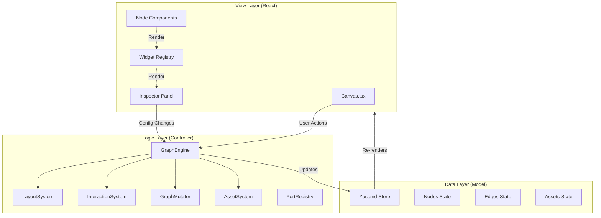
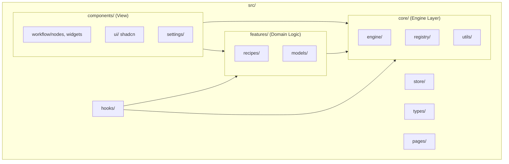
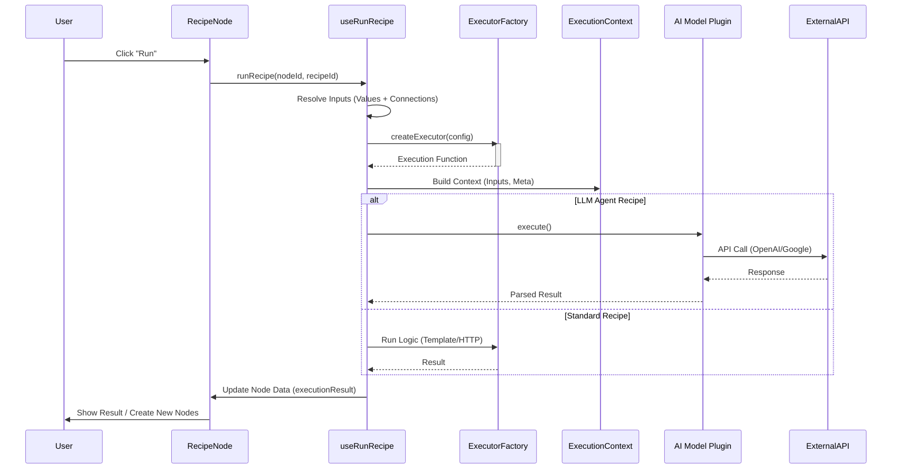
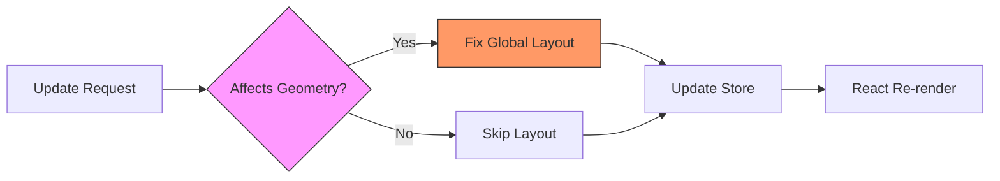

# Synnia Architecture Visualizations

## 1. High-Level Architecture (MVC-ish)
This diagram illustrates the separation of concerns between the **View Layer** (React Components), **Logic Layer** (GraphEngine), and **Data Layer** (Zustand Store).

## 2. Project Directory Structure
Updated to reflect the new modular organization.

## 3. Recipe System Execution Flow
This diagram shows how a Recipe Node executes, from the user clicking "Run" to the final result updating the node.

## 4. Node Update & Optimization Flow
Illustrating the "Throttled Layout" pattern.

