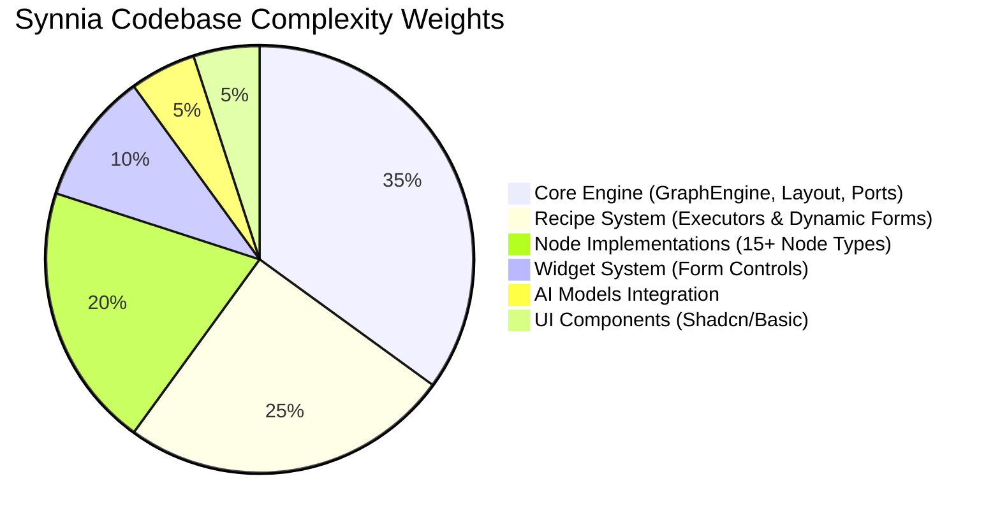
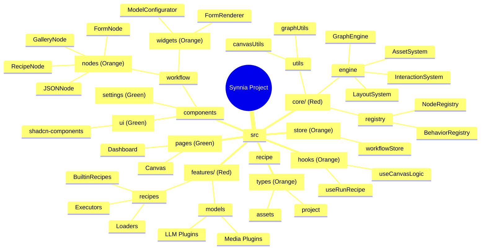
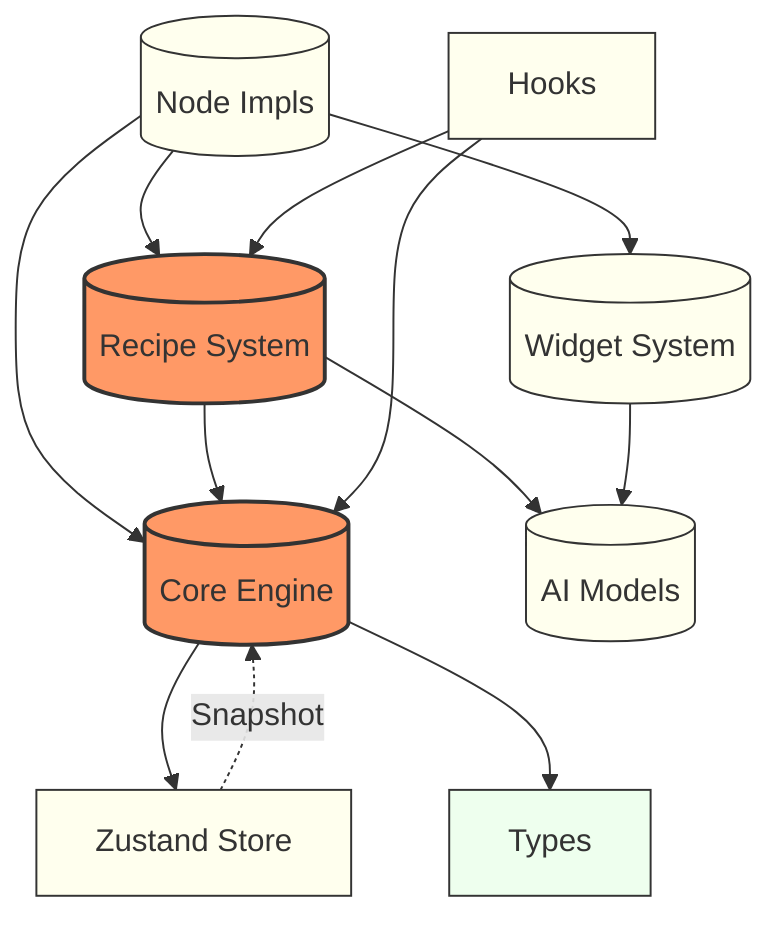
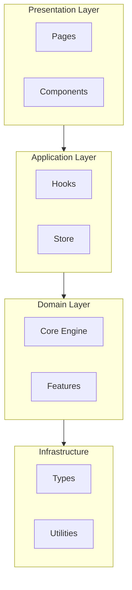

# Codebase Complexity Analysis

## 1. Complexity Distribution (The "Weight" of Modules)
This pie chart illustrates where the logical complexity resides in the project.

## 2. Directory Structure & Depth Analysis
This mindmap visualizes the project structure, color-coded by complexity.
*   **Red**: Critical/High Complexity (Requires deep domain knowledge)
*   **Orange**: Medium Complexity (Component logic)
*   **Green**: Low Complexity (View/Drafting)

## 3. Dependency Density Network
Visualizing how modules depend on each other. The **Engine** and **Recipe System** are the high-traffic hubs.

## 4. Clean Architecture Layers

