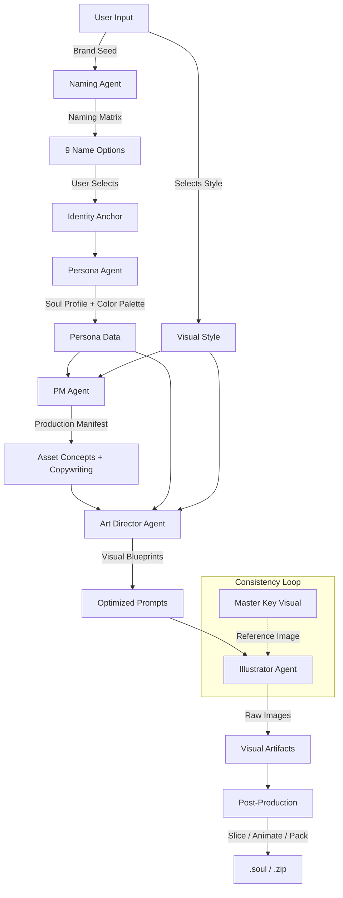

# The Soulmate Protocol (v1.2)

**The Industrial Standard for AI-Powered Digital Asset Generation**

This document defines the underlying architecture, asset taxonomy, and agentic workflow used by **AI Brand Soulmate**. It transforms abstract commercial concepts into fully realized, production-ready virtual IP assets.

---

## 🏛️ Phase 1: Genesis (The Soul)

**Objective:** Extract a unique "soul" from raw business requirements.

### 📦 Asset 1: Brand Seed
*   **Source:** User Input
*   **Definition:** Raw business data.
*   **Schema:** `{ ProductType, TargetAudience, BrandTone, CulturalBackground, SpecialRequirements }`

### 🤖 Agent A: The Architect (IP Naming Specialist)
*   **Role:** Semiotics & Naming Strategy.
*   **Logic:** Uses the **Relevance Spectrum** strategy to generate names ranging from "Functional" to "Abstract".
*   **Input:** Brand Seed.
*   **Output:** Naming Matrix (9 Candidates).

### 📦 Asset 2: Identity Anchor
*   **Source:** User Decision.
*   **Definition:** The selected Name, Slogan, and Rationale that anchors the virtual identity.

---

## 🧬 Phase 2: Persona (The Personality)

**Objective:** Flesh out the name into a living, breathing character.

### 🤖 Agent B: The Chief Storyteller
*   **Role:** Character Design & Creative Writing.
*   **Logic:** Translates abstract brand values into concrete visual traits (Visual DNA) and backstory.
*   **Input:** Brand Seed + Identity Anchor.
*   **Output:** Soul Profile.

### 📦 Asset 3: Soul Profile
*   **Source:** Generated by Agent B.
*   **Definition:** The "Bible" of the character.
*   **Key Data:**
    *   **Visual DNA:** Precise text description of Hair, Outfit, Accessories.
    *   **Personality:** Voice style, traits.
    *   **Brand Synergy:** How the character represents the product.
    *   **Color Palette (v1.1):** Primary, Secondary, Accent, Background HEX codes.

---

## 🎨 Phase 3: Blueprint (The Plan)

**Objective:** Convert literary descriptions into engineering specifications.

### 📦 Asset 4: Visual Style Filter
*   **Source:** User Selection (e.g., "3D Blind Box", "Cyberpunk").
*   **Definition:** Standardized rendering parameters and aesthetic rules.

### 🤖 Agent C: The Product Manager (PM)
*   **Role:** Requirements Analysis & Planning.
*   **Logic:**
    1.  **Contextual Analysis:** Analyzes `ProductType` (e.g., E-commerce vs. Game).
    2.  **Asset Selection:** Selects necessary assets from the **Asset Taxonomy** (Grid Family, Marketing Family, Merch Family, Game Family, Texture Family).
    3.  **Copywriting:** Writes **Micro-Copy** (Dialogue) for each asset based on Persona voice.
*   **Input:** Soul Profile + Visual Style Filter.
*   **Output:** Production Manifest.

### 🤖 Agent D: The Art Director
*   **Role:** Prompt Engineering & Consistency Control.
*   **Logic:**
    1.  **Visual Anchoring:** Injects Visual DNA into every prompt.
    2.  **Style Injection:** Applies Style Filter modifiers.
    3.  **Color Injection (v1.1):** Enforces the Color Palette in prompts.
    4.  **Constraint Enforcement:** "No Text", "Sprite Sheet", "4K Resolution".
*   **Input:** Production Manifest + Soul Profile.
*   **Output:** Visual Blueprints (Ready-to-execute Prompts).

---

## 🖌️ Phase 4: Materialization (The Asset)

**Objective:** Rendering and Delivery.

### 🤖 Agent E: The Lead Illustrator
*   **Role:** Pixel Generation.
*   **Model:** Gemini 3.0 Pro Image.
*   **Logic:**
    *   **Image-to-Image:** Uses the *Master Key Visual* as a reference for all secondary assets to ensure consistent facial features.
    *   **High-Res Mode:** Generates UI Kits in 4K.
*   **Input:** Visual Blueprint + Reference Image.
*   **Output:** Visual Artifacts (Raw Images).

### 🤖 Agent F: Post-Production Engineer
*   **Role:** Processing & Packaging.
*   **Tools:** Canvas API, JSZip, GIF Encoder.
*   **Logic:**
    *   **Slicing:** Detects 3x3 Grids and slices them into individual PNGs.
    *   **Animation (v1.2):** Compiles sequence grids into animated GIFs.
    *   **Packaging:** Compiles assets, metadata, and documentation into `.soul` or `.zip` files.
*   **Output:** Final Deliverables.

---

## 📊 Asset Taxonomy

Assets are categorized into families with specific behaviors (defined in `utils/assetDefinitions.ts`):

1.  **Grid Family (The Toolkit)**
    *   *Structure:* 3x3 Grid, 4K Resolution.
    *   *Behavior:* Slicable, Sprite Sheet.
    *   *Types:* `ui-kit-core`, `icon-set-variant`, `sticker-pack`, `tool-icons`.

2.  **Marketing Family (The Vibe)**
    *   *Structure:* Specific Aspect Ratios (16:9, 9:16).
    *   *Behavior:* High Atmosphere, Environmental.
    *   *Types:* `marketing-poster`, `social-cover`, `splash-screen`, `character-main`.

3.  **Merch Family (The Product)**
    *   *Structure:* Mockup Composition (1:1).
    *   *Behavior:* Product Visualization.
    *   *Types:* `merch-tshirt`, `merch-mug`, `merch-tote`.

4.  **Game/Technical Family (The Engine - v1.1)**
    *   *Structure:* Technical Views, High Resolution.
    *   *Behavior:* Reference for modeling/dev.
    *   *Types:* `character-turnaround`, `expression-sheet`, `game-item-sheet`, `isometric-building`.

5.  **Texture Family (The Background - v1.1)**
    *   *Structure:* Seamless or Abstract.
    *   *Behavior:* UI Backgrounds.
    *   *Types:* `app-texture-pack`, `hero-background`.

6.  **Animation Family (The Motion - v1.2)**
    *   *Structure:* Sequential Grid.
    *   *Behavior:* Playable, GIF Export.
    *   *Types:* `animation-loading`, `animation-run-cycle`.

---

## 🔄 The Data Flow

