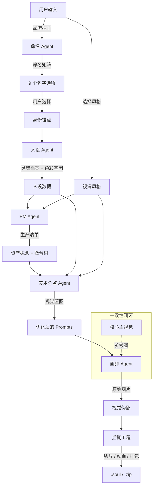

# 灵魂伴侣协议 (The Soulmate Protocol v1.2)

**AI 驱动数字资产生成的工业级标准**

本文档定义了 **AI 品牌人格化设计师 (AI Brand Soulmate)** 的底层架构、资产分类学以及智能体工作流。它旨在将抽象的商业概念转化为完全落地、生产就绪的虚拟 IP 资产。

---

## 🏛️ 第一阶段：创世纪 (Genesis)

**目标：** 从原始的商业需求中提取出独一无二的“灵魂”。

### 📦 资产 1：品牌种子 (Brand Seed)
*   **来源：** 用户输入
*   **定义：** 原始的商业数据。
*   **数据结构：** `{ 产品类型, 目标受众, 品牌调性, 文化背景, 特殊需求 }`

### 🤖 Agent A：架构师 (IP 命名专家)
*   **职责：** 符号学解构与命名策略。
*   **逻辑：** 采用 **“相关度光谱 (Relevance Spectrum)”** 策略，生成从“功能描述型”到“抽象联想型”的命名矩阵。
*   **输入：** 品牌种子。
*   **输出：** 命名矩阵 (9 个候选方案)。

### 📦 资产 2：身份锚点 (Identity Anchor)
*   **来源：** 用户决策。
*   **定义：** 被选定的名字、Slogan 以及设计理念。它是连接商业世界与虚拟世界的桥梁。

---

## 🧬 第二阶段：人格 (Persona)

**目标：** 赋予名字以血肉，使其成为一个“人”。

### 🤖 Agent B：首席故事官 (The Chief Storyteller)
*   **职责：** 角色设计与创意写作。
*   **逻辑：** 将抽象的品牌价值转化为可视化的特征（视觉 DNA）和背景故事。
*   **输入：** 品牌种子 + 身份锚点。
*   **输出：** 灵魂档案。

### 📦 资产 3：灵魂档案 (Soul Profile)
*   **来源：** 由 Agent B 生成。
*   **定义：** 角色的“圣经”设定集。
*   **核心数据：**
    *   **视觉 DNA (Visual DNA)：** 对发型、服装、配饰的精确文本描述。
    *   **性格 (Personality)：** 说话风格、核心特质。
    *   **品牌共鸣 (Brand Synergy)：** 角色如何体现产品价值。
    *   **色彩基因 (Color Palette - v1.1)：** 主色、辅色、强调色、背景色的 Hex 代码。

---

## 🎨 第三阶段：蓝图 (Blueprint)

**目标：** 将文学描述转化为可执行的工程指令。

### 📦 资产 4：视觉风格滤镜 (Visual Style Filter)
*   **来源：** 用户选择 (例如：“3D 盲盒风”, “赛博朋克风”)。
*   **定义：** 标准化的视觉渲染参数和美学规范。

### 🤖 Agent C：产品经理 (The Product Manager)
*   **职责：** 需求分析与资产规划。
*   **逻辑：**
    1.  **场景分析：** 分析 `产品类型` (例如：电商 vs 游戏)。
    2.  **资产选型：** 从 **资产分类学** 中挑选必要的资产组合 (网格家族, 营销家族, 周边家族, 游戏家族, 纹理家族)。
    3.  **微文案创作 (Copywriting)：** 根据人设语气，为每个资产编写专属的 **微台词 (Micro-Copy)**。
*   **输入：** 灵魂档案 + 视觉风格滤镜。
*   **输出：** 生产清单 (Production Manifest)。

### 🤖 Agent D：美术总监 (The Art Director)
*   **职责：** 提示词工程 (Prompt Engineering) 与一致性控制。
*   **逻辑：**
    1.  **视觉锚定 (Visual Anchoring)：** 将视觉 DNA 强制注入到每一条 Prompt 中。
    2.  **风格注入 (Style Injection)：** 应用风格滤镜的修饰词。
    3.  **色彩注入 (Color Injection - v1.1)：** 强制应用灵魂档案中的配色方案。
    4.  **约束执行：** 强制执行“无文字”、“精灵图 (Sprite Sheet)”、“4K 分辨率”等指令。
*   **输入：** 生产清单 + 灵魂档案。
*   **输出：** 视觉蓝图 (可执行的 Prompts)。

---

## 🖌️ 第四阶段：具象化 (Materialization)

**目标：** 渲染与交付。

### 🤖 Agent E：首席画师 (The Lead Illustrator)
*   **职责：** 像素级生成。
*   **模型：** Gemini 3.0 Pro Image。
*   **逻辑：**
    *   **图生图 (Image-to-Image)：** 使用 *核心主视觉 (Master Key Visual)* 作为所有次级资产的参考图，确保面部特征一致。
    *   **高分渲染：** 为 UI Kit 开启 4K 模式。
*   **输入：** 视觉蓝图 + 参考图。
*   **输出：** 视觉伪影 (Raw Images)。

### 🤖 Agent F：后期工程师 (Post-Production Engineer)
*   **职责：** 加工与打包。
*   **工具：** Canvas API, JSZip, GIF Encoder。
*   **逻辑：**
    *   **切片 (Slicing)：** 识别 3x3 网格并将其切割为独立的 PNG 文件。
    *   **动画合成 (Animation - v1.2)：** 将序列帧网格编码为 GIF 动画。
    *   **打包 (Packaging)：** 将资产、元数据和文档编译为 `.soul` 或 `.zip` 文件。
*   **输出：** 最终交付物。

---

## 📊 资产分类学 (Asset Taxonomy)

资产被划分为具有特定行为的家族 (定义于 `utils/assetDefinitions.ts`)：

1.  **网格家族 (The Grid Family - 工具箱)**
    *   *结构：* 3x3 网格, 4K 分辨率。
    *   *行为：* 支持智能切片 (Sliceable), 精灵图。
    *   *类型：* `ui-kit-core` (核心UI), `icon-set-variant` (图标变体), `sticker-pack` (表情包), `tool-icons` (功能图标)。

2.  **营销家族 (The Marketing Family - 氛围组)**
    *   *结构：* 特定画幅 (16:9, 9:16)。
    *   *行为：* 强氛围感, 环境描写。
    *   *类型：* `marketing-poster` (海报), `social-cover` (社媒封面), `splash-screen` (开屏页), `character-main` (主视觉)。

3.  **周边家族 (The Merch Family - 实体品)**
    *   *结构：* 样机合成 (Mockup, 1:1)。
    *   *行为：* 产品可视化。
    *   *类型：* `merch-tshirt` (T恤), `merch-mug` (马克杯), `merch-tote` (帆布袋)。

4.  **游戏/技术家族 (The Game Family - 核心向 - v1.1)**
    *   *结构：* 技术视图, 高分辨率。
    *   *行为：* 建模参考, 开发素材。
    *   *类型：* `character-turnaround` (三视图), `expression-sheet` (表情差分), `game-item-sheet` (道具图集), `isometric-building` (等轴建筑)。

5.  **纹理家族 (The Texture Family - 背景组 - v1.1)**
    *   *结构：* 无缝或抽象。
    *   *行为：* UI 背景平铺。
    *   *类型：* `app-texture-pack` (应用纹理), `hero-background` (主页大图)。

6.  **动画家族 (The Animation Family - 动态组 - v1.2)**
    *   *结构：* 序列帧网格。
    *   *行为：* 播放预览, 导出 GIF。
    *   *类型：* `animation-loading` (加载动画), `animation-run-cycle` (行走循环)。

---

## 🔄 数据流转图

